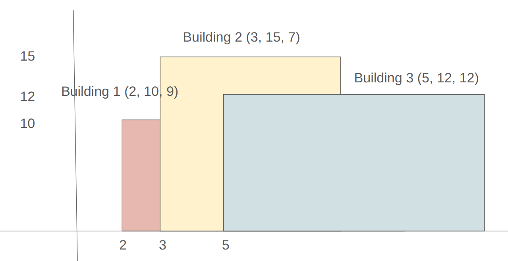

# CS560 HW3.5 - Skyline Algorithm Problem

## Language / Libraries
- Python
- matplotlib (for visualization)

## Problem Overview
Each building is represented as a rectangle with 3 attributes:
- Left: The x-coordinate of the building's left edge
- Height: The building's height
- Right: The x-coordinate of the building's right edge

The goal of the skyline algorithm is to to compute the visible outline formed by a collection of overlapping buildings.

---

## Example
- Input:  
  `Buildings = [(2, 10, 9), (3, 15, 7), (5, 12, 12)]`

- Output:  
  `Skyline = [(2, 10), (3, 15), (7, 12), (12, 0)]`

- Explanation:
  - (2, 10): A building of height 10 starts at x = 2.
  - (3, 15): A taller building of height 15 starts at x = 3.
  - (7, 12): The taller building ends and a shorter one remains.
  - (12, 0): All buildings end at x = 12.



---

## Brute Force Algorithm

In the brute force algorithm, traverse each x-coordinate from 0 to the maximum x value and record the maximum building height at each point.  
Build an array to store the maximum height at each x-coordinate and identify changes in height to extract the critical points.

### Code Explanation
```python
largest_x = max(building.r for building in buildings)
```
→ Find the furthest x-coordinate to determine the range.

```python
heights = [0] * (largest_x + 1)
```
→ Initialize a list to store the height at each x.

```python
for b in buildings:
    for i in range(b.l, b.r):
        heights[i] = max(heights[i], b.h)
```
→ Update the height array with the tallest building at each x.

```python
for i in range(len(heights)):
    if heights[i] != prevHeight:
        result.append(CriticalPoint(i, heights[i]))
        prevHeight = heights[i]
```
→ Only record changes in height as critical points.

### Complexity
- Time: O(NK)
- Space: O(K)

---

## Divide and Conquer Algorithm

Divide the list of buildings into two parts and recursively compute their skylines. Merge them into the final skyline.

### Code Explanation

#### merge(l, r)
```python
while i < len(l) and j < len(r):
    if l[i].x < r[j].x:
        x = l[i].x
        h1 = l[i].h
        i += 1
    elif r[j].x < l[i].x:
        x = r[j].x
        h2 = r[j].h
        j += 1
    else:
        x = l[i].x
        h1 = l[i].h
        h2 = r[j].h
        i += 1
        j += 1
    maxHeight = max(h1, h2)
    if not result or result[-1].h != maxHeight:
        result.append(CriticalPoint(x, maxHeight))
```
→ Compare the x-coordinates of the current points from both skylines. <br>
→ Update the height depending on which point comes first, or both if they are qual. <br>
→ Compute the maximum height at the current x. <br>
→ If the maximum height is different from the last added critical point, add a new point to the result. <br>


```python
while i < len(l):
    result.append(l[i])
    i += 1

while j < len(r):
    result.append(r[j])
    j += 1
```
→ After one of the skylines is fully processed, append the remaining critical points from the other skyline


#### divideAndConquer(buildings)
```python
if len(buildings) == 1:
    b = buildings[0]
    return [CriticalPoint(b.l, b.h), CriticalPoint(b.r, 0)]
```
→ Base case: return the start and end of a single building.

```python
mid = len(buildings) // 2
left = divideAndConquer(buildings[:mid])
right = divideAndConquer(buildings[mid:])
return merge(left, right)
```
→ Divide buildings, solve recursively, and merge the skylines.

### Complexity
- Time: O(N log N)
- Space: O(N)

---

## Sweep Line Algorithm

Convert building start and end positions into events and process them in sorted order, tracking current building heights.

### Code Explanation
```python
events.append((b.l, -b.h))  # start
events.append((b.r, b.h))   # end
```
→ Negative heights for start, positive for end. Ensures starts come before ends at the same x.

```python
events.sort()
```
→ Sort by x; tie-breaking handled by height.

```python
for x, h in events:
    if h < 0:
        heights.append(-h)
    else:
        heights.remove(h)
    currentMax = max(heights)
    if currentMax != prev_max:
        result.append(CriticalPoint(x, currentMax))
        prev_max = currentMax
```
→ Add or remove heights, and track when the maximum height changes.

### Complexity
- Time: O(N log N)
- Space: O(N)

---

## Event-Based Insight

When using events for the Sweep Line algorithm:
- Starts are stored as negative heights.
- Ends are positive.
- Sorting ensures that start events are processed before end events when they occur at the same x-coordinate.

### Example:
```
Building A: (3, 10, 11)
Building B: (5, 12, 8)
Events = [(3, -10), (5, -12), (8, 12), (11, 10)]
```

---